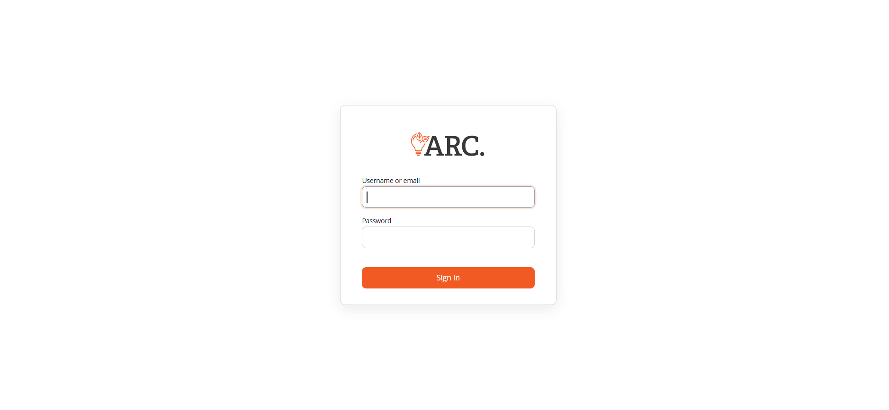

# **Research Data Management & Analytics Platform**

A fully integrated research data management and analytics environment was designed and deployed within the **Research & Innovation Department**.  
The platform was built using **containerized services** orchestrated with **Docker**, ensuring portability, scalability, and reproducibility across environments.

##  Overview
A brief description of the purpose, context (Research & Innovation Department), and high-level impact.

---
##  Architecture

  
*High-level architecture showing the interaction between components and authentication flow.*

---

## **Core Components**

- **postgres** – Created a database to centralize the data generated in the labs.
- 
- **eLabFTW** – Configured as the department’s **Electronic Lab Notebook (ELN)**  
  - Customized for research workflows and metadata standards  
  - Enabled timestamped data certification for reproducibility and compliance  

- **Apache Airflow** – Deployed for **ETL automation** and data orchestration
  - Scheduled ingestion, transformation, and synchronization of datasets  
  - Modular pipelines to support multiple research projects in parallel  

- **Apache Superset** – Integrated for **interactive dashboards and advanced analytics**  
  - Connected to operational and analytical databases for real-time reporting  
  - Designed visualizations to monitor research activity, trends, and KPIs  

---

## **Security & Authentication**

- **Keycloak** implemented as the **central identity provider**  
  - Used **OpenID Connect** and **SAML** for single sign-on (SSO) across all services  
  - Managed **role-based access control (RBAC)** to enforce data governance policies  

- **NGINX Reverse Proxy** with **SSL/TLS encryption**  
  - Domain-based routing for each service  
  - Enforced secure access via HTTPS for all endpoints  

---

## **Infrastructure**

- **Cloud Hosting:** Azure Virtual Machines with optimized configurations for concurrent workloads  
- **Persistent Storage:** Docker volumes for long-term data retention  
- **Automated Backups:** Snapshot policies for disaster recovery readiness  
- **Performance Tuning:** Optimized container resources and database indexing for faster queries  

---

## **Impact**

This implementation:  

- Consolidated multiple research tools into a **single, cohesive platform**  
- Reduced administrative overhead through automation and SSO  
- Improved collaboration and data transparency across research teams  
- Established a **standardized data lifecycle** from capture to visualization  
- Created a foundation for future **machine learning and predictive analytics** initiatives  

##  User Flow

### 1. End-to-End Workflow
- Login in Keycloak
  
- Login to Django Portal: This portal is temporary, this is why the UI does not finished.  
  The user now is able to access to either 3 applications implemented: Airflow, Superset or elabFTW.  
  _Note: This user has privilegues to access to all apps. If there is any user with one app permission, the UI will only show one app._  
  
- Accessing to Airflow:
  
- Accessing to SuperSet:
  
- Accessing to elabFTW: Once the user click on elabFTW app, it will open a new window with the app, as shown.
  

